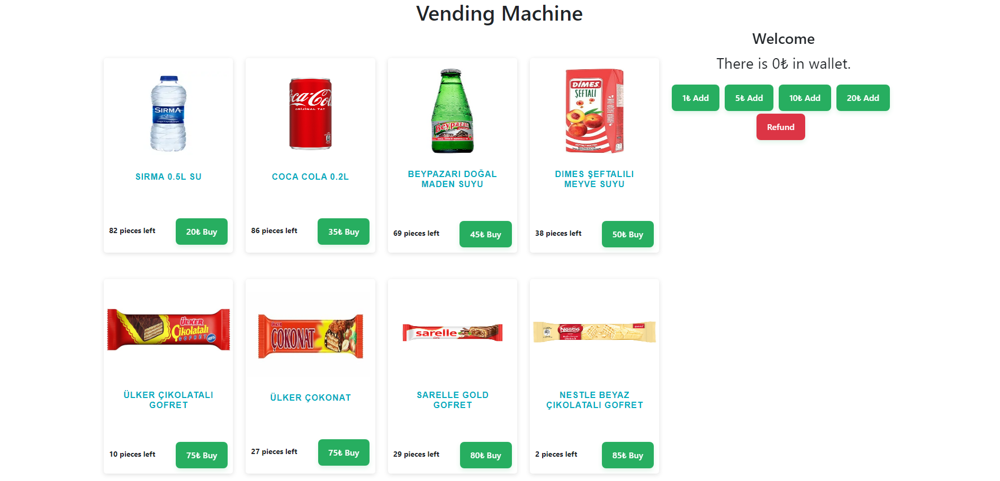

# Vending Machine React App

This is a React application that simulates a vending machine. It also includes a supplier interface for managing products and units.



## Table of Contents

- [Features](#features)
- [Technologies Used](#technologies-used)
- [Installation](#installation)
- [Usage](#usage)
- [Contributing](#contributing)
- [License](#license)

## Features

- **Customer Interface**
  - View available products
  - Buy product
  - Interact with an active wallet

- **Supplier Interface**
  - Add/Edit/Delete products
  - Add/Edit/Delete units
  - View total revenue
  - Logout

## Technologies Used

- React
- React Router
- Local Storage for authentication

## Installation

To run this project locally, you'll need to have `Node.js` and `npm` installed. Then follow these steps:

1. Clone the repository:
   ```bash
   git clone https://github.com/your-username/vending-machine.git
    ```
2. Navigate to the project folder:
    ```bash
   cd vending-machine
    ```
3. Install dependencies:
    ```bash
   npm install
    ```
4. Start the development server:
    ```bash
   npm start
    ```
Now, the app should be running on http://localhost:3000.

## Usage
- Open the app in a web browser.
- For the customer interface, just interact with the products and the active wallet.
- For the supplier interface, navigate to `/supplier` and log in to manage products and units.